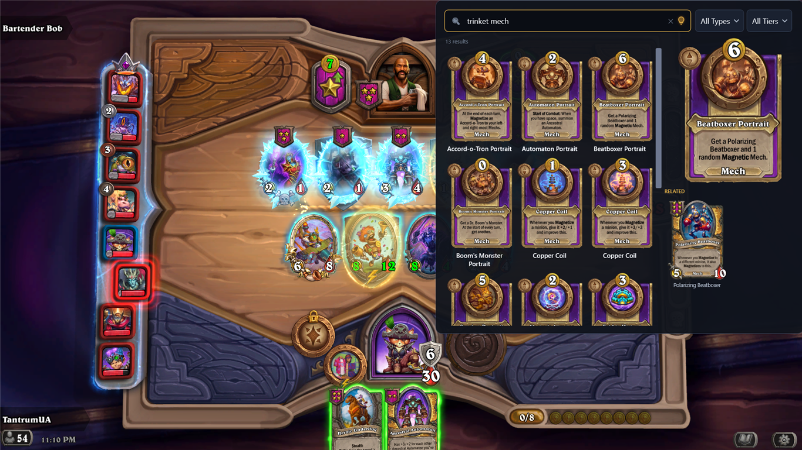
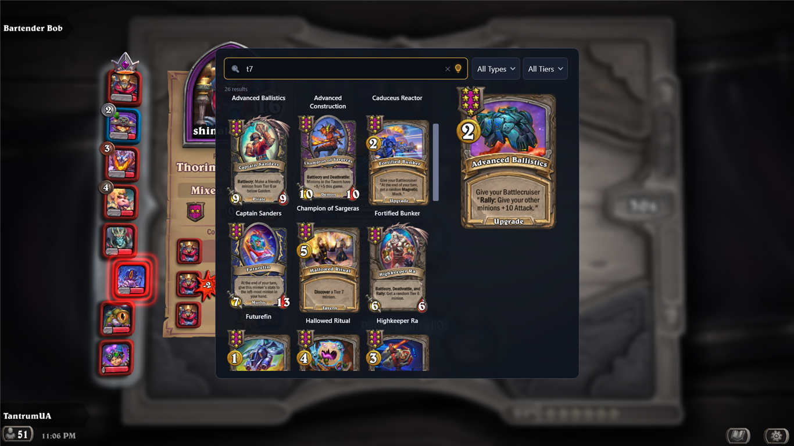
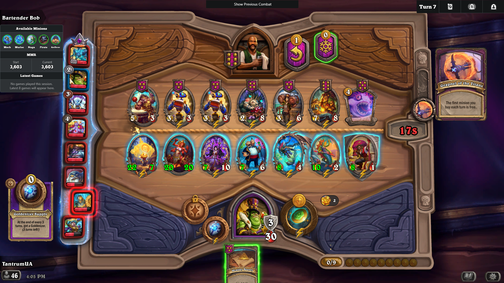
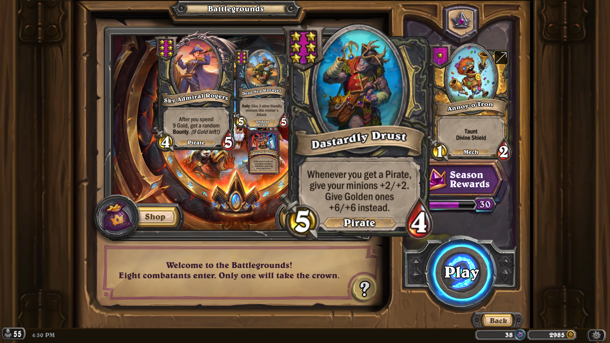
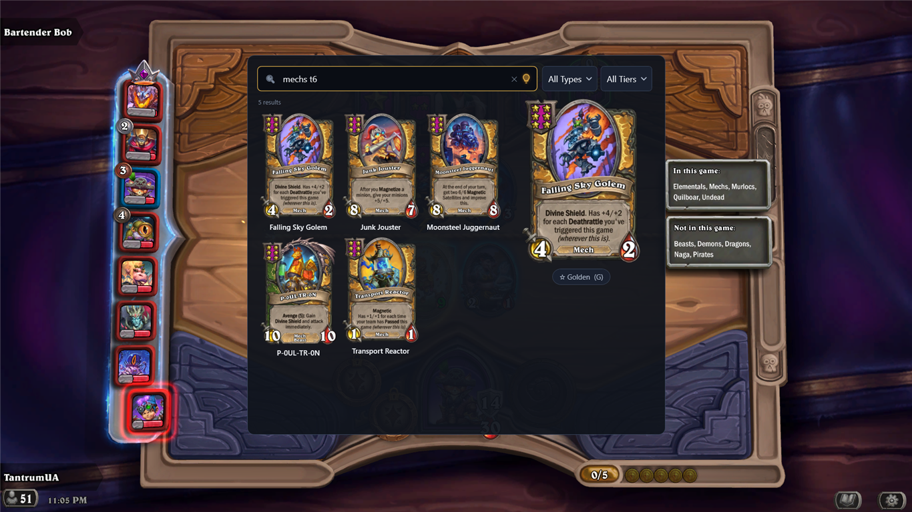
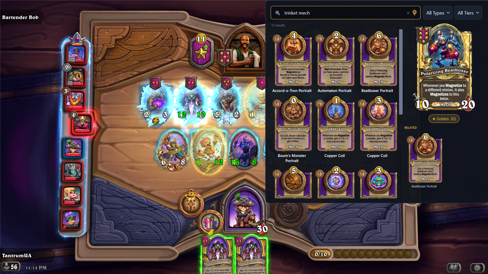

# HSBG Card Lookup — Hearthstone Deck Tracker plugin

**English** | [Українська](README.ua.md)

An in-game search overlay for **Hearthstone Battlegrounds** cards. Press a hotkey, a search panel
pops over the game, type to find any card (smart filters for tier, tribe, keywords, stats), browse
art, dismiss. The desktop sibling of [hsbg.cards](https://hsbg.cards).



- Fast fuzzy + structured search (`t3`, `5/5`, tribes, keywords, spell schools)
- Full card art, golden variants, related cards (buddies / tokens / hero powers)
- **Drag any card out** of the overlay as a free-floating, resizable card — handy for explaining
  cards to viewers on stream or while making a video, or just parking a few in a corner for reference
- **Live trinkets & anomaly HUD** — your current lesser/greater trinkets and the lobby anomaly shown
  right on screen during a match, so neither you nor your viewers have to hover over each one. Great for
  streaming or solo play, and especially for **phone viewers** who can't open HDT's Twitch extension to
  see which anomaly is active or which trinkets the streamer has
- In-app patch-notes notifications
- Card data and art self-update from hsbg.cards; the plugin auto-updates via GitHub Releases

v0.3 Additions: 
- MMR and Opponents Tiers display in-lobby
- Dark Gifts support in 3 modes - show relevant minions after turn 6 ; show available dark gifts ; show both available dark gifts and relevant minions with unique gifts applicable to them
- Save your match boards to a .csv file each round for a data analysis later
- Other small QoL changes 

<p align="center">
  
  
  
  
  
</p>

> Windows only — it's a Hearthstone Deck Tracker plugin. (Mac players: use the website for now, the release might be presented later.)

## Install

1. Download the latest release zip from [Releases](https://github.com/RTantrumR/HDT-Plugin-Cards/releases).
2. Extract it, then double-click **`install.bat`** (it closes HDT, copies the plugin into place).
   *Or* manually drop the `HsbgCardLookup` folder into
   `%APPDATA%\HearthstoneDeckTracker\Plugins\`.
3. Start HDT (enable the plugin under **Options → Plugins** if prompted).
4. Press **F3** to open the search.

On first launch the plugin downloads card art in the background (~200 MB, one time); after that it
loads instantly and only fetches changed cards.

### Controls

| Key | Action |
|---|---|
| `F3` | open / close the overlay |
| type | search (Tab toggles smart search, Esc closes, Enter opens the first result) |
| `F2`/`G` | toggle the golden version of the selected minion |
| `S` | re-focus the search box |
| click art | open that card on hsbg.cards |

Keys are rebindable via the plugin's **Settings** button in HDT. The same dialog toggles the
**card drag-out** (from the detail art and/or the results grid) and the **trinkets / anomaly HUD**
(opt-in). Drag a floating card by its body to move it, drag its top-right corner to resize, right-click
to dismiss; HUD cards remember their place and size per slot and only show while Hearthstone/HDT is
focused.

## Requirements

- **Hearthstone Deck Tracker** installed.
- Hearthstone in **Borderless / Windowed (Fullscreen)** mode (exclusive fullscreen blocks any
  overlay — this is HDT's own requirement too).
- .NET Framework 4.7.2 (already present if HDT runs).

## Building from source

**Toolchain:** .NET Framework 4.7.2, WPF, C#. Build with **MSBuild from Visual Studio 2022** — the
`dotnet` CLI can't run the WPF markup compiler for net472. The project is a classic-style `.csproj`
on purpose (SDK-style `<UseWPF>` is a .NET Core feature, unreliable on net472).

Two sets of files are **not** committed and must be placed in `libs\` once (they're third-party /
large):

```powershell
# 1. HDT's own assemblies — referenced, not redistributed (Private=False).
$src = "$env:LOCALAPPDATA\HearthstoneDeckTracker\app-<newest version>"
Copy-Item "$src\HearthstoneDeckTracker.exe" .\libs\
Copy-Item "$src\HearthDb.dll" .\libs\
Copy-Item "$src\Newtonsoft.Json.dll" .\libs\

# 2. The WebP decoder closure (bundled with the plugin, Private=True).
#    Build a throwaway net472 project that references SixLabors.ImageSharp 2.1.11 and copy its
#    output DLLs into libs\: SixLabors.ImageSharp.dll, System.Buffers.dll, System.Memory.dll,
#    System.Numerics.Vectors.dll, System.Runtime.CompilerServices.Unsafe.dll,
#    System.Text.Encoding.CodePages.dll
```

The bundled card snapshot `HsbgCardLookup\data\cards.json` is also gitignored — drop in any
`{ patch, cardCount, cards: [...] }` snapshot (the plugin refreshes it from the API at runtime
anyway).

```powershell
.\deploy.ps1                 # build Release + copy into HDT's Plugins folder (auto-restarts HDT)
.\package.ps1                 # build + dist\HsbgCardLookup-v<ver>.zip (version auto-read from Plugin.cs; -Version overrides)
```

AnyCPU loaded into HDT's x86 process → the `MSB3270` arch-mismatch warning is expected and harmless.

## License

[Apache License 2.0](LICENSE). See [NOTICE](NOTICE) for bundled third-party components.

The opponent-MMR leaderboard feature was inspired by
[HDT-BGMMRPlugin](https://github.com/Reign-in-blood/HDT-BGMMRPlugin) (MIT), then modified and
extended with additional features and this plugin's own data source — see NOTICE for details.

Hearthstone is a trademark of Blizzard Entertainment, Inc. This is an unofficial fan project, not
affiliated with or endorsed by Blizzard.
