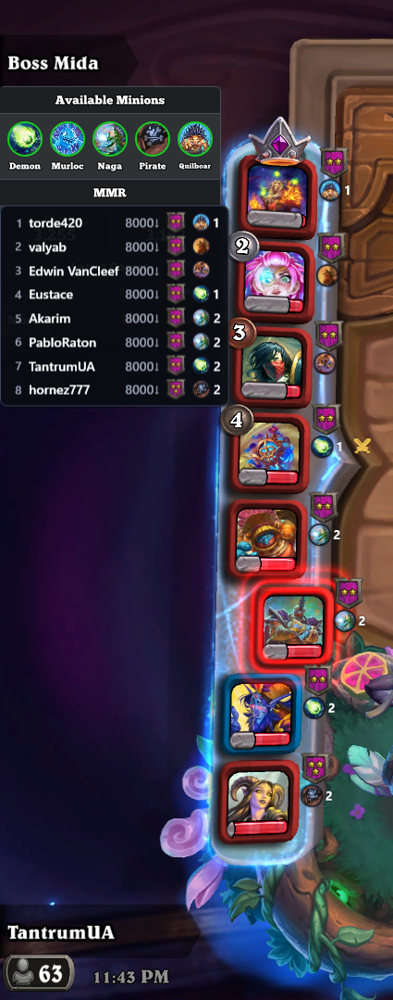
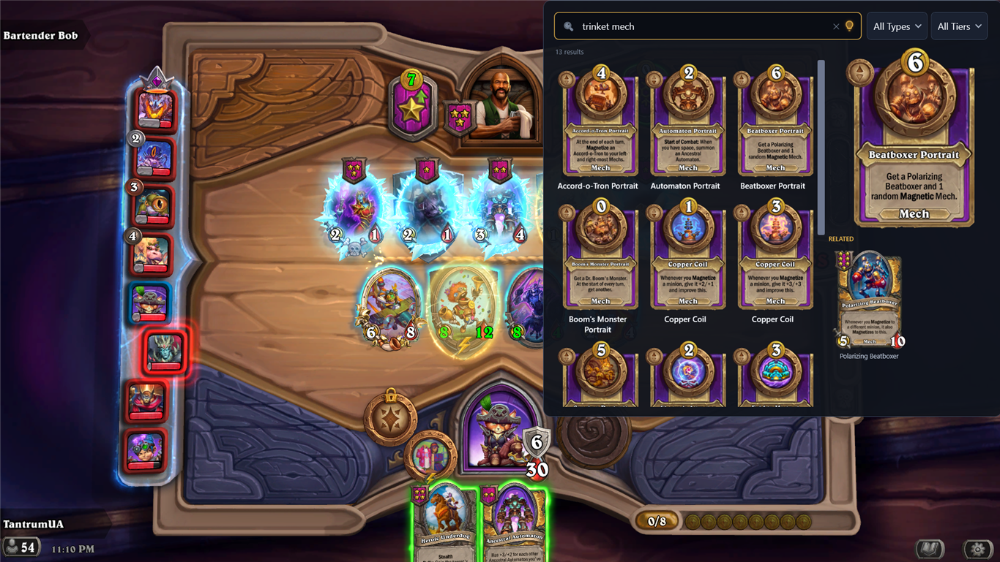
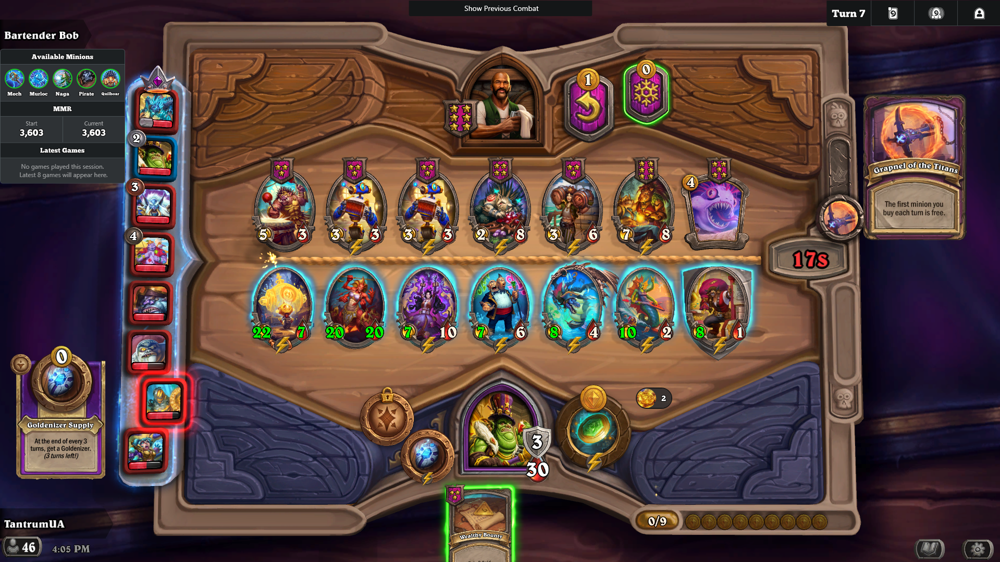
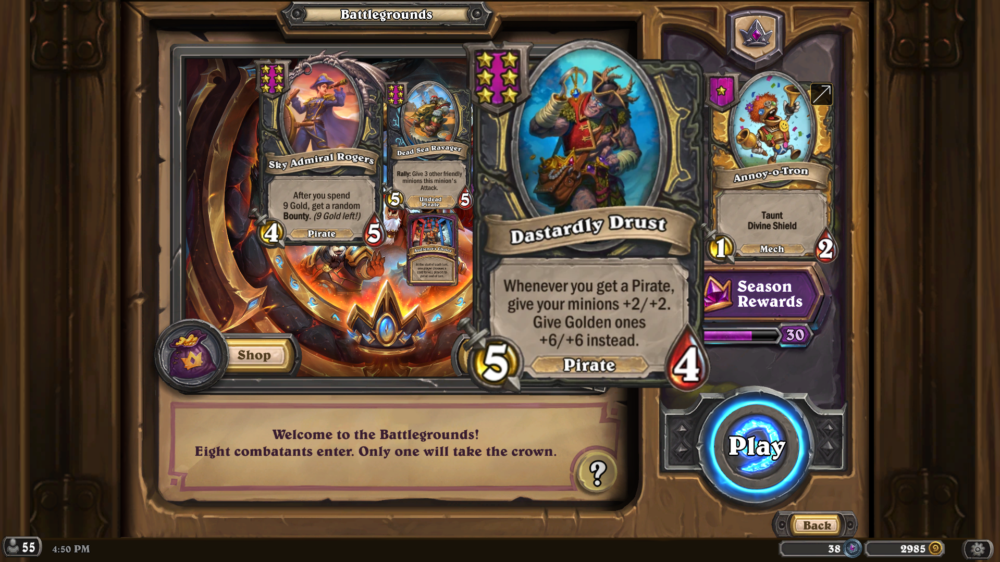
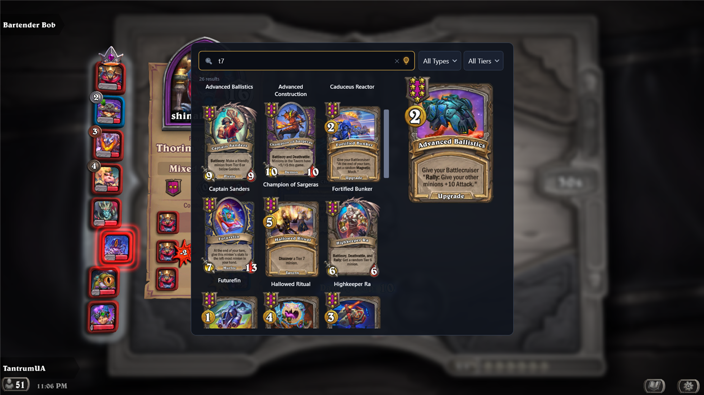
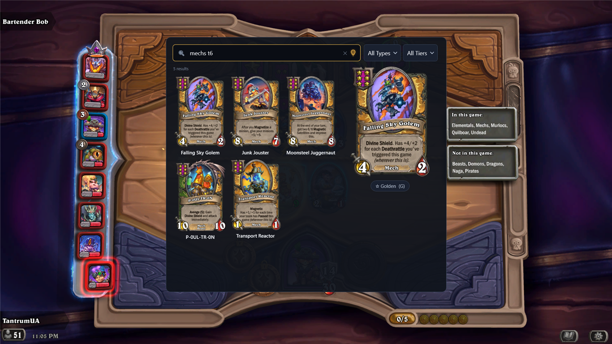
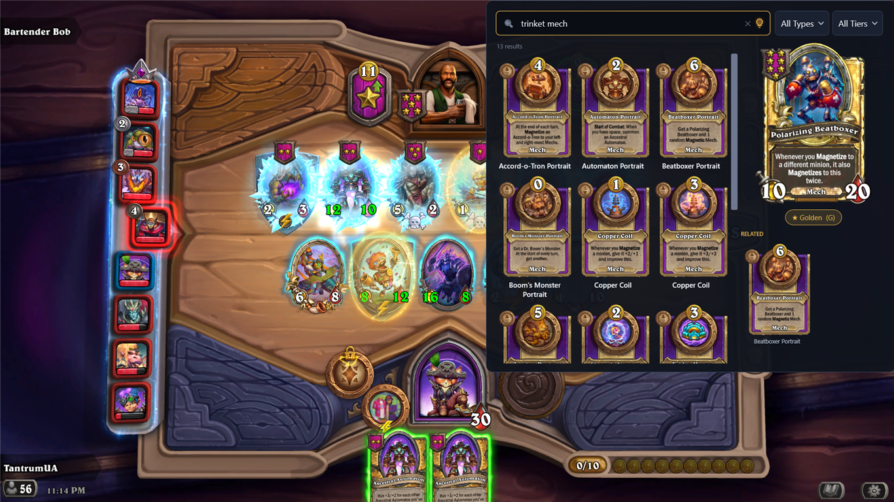

# Tantrum's Battlegrounds Toolkit

**English** | [Українська](README.ua.md)

A [Hearthstone Deck Tracker](https://hsdecktracker.net/) plugin for Battlegrounds players. It puts the
things you would otherwise hover, alt-tab or memorise on screen while you play.

**On the overlay, all match long**

- **Opponent tiers and minion types**: every player's tavern tier and the minion type they have most
  of, with its count, next to their leaderboard portrait from turn 1. The game shows this only while
  you hover a portrait; here it is always on screen.
- **Opponent MMR**: each opponent's rating and today's gain or loss, on the portraits, in a movable
  standings panel, or both. Solo and Duos.
- **Dark Gifts**: a "?" above the Dark Discovery button opens every gift you can still be offered,
  what it does and which minions can carry it, with the ones available this turn highlighted. From
  turn 6 it also shows the minion pool of your guaranteed type.
- **Trinkets and anomaly**: your trinkets and the lobby anomaly stay visible for the whole match.
- **Match recap**: when a solo match ends, a small panel shows your APM, best turn and damage dealt,
  next to your own averages for the season.

**One key away**

- **Card search**: press `F3` and type to find any card by name, tier, minion type, keyword or stats
  (`t3`, `5/5`, `trinket mech`). Golden versions, tokens, buddies and hero powers included.
- **Floating cards**: drag a card out of the search and leave it on screen at any size, for yourself
  or for your viewers.
- **Match export**: your board after every round, saved to a CSV file. (Work in progress for full visualized board snapshots and match analysis)

Standard setup includes opponents' Tavern Tier and Tribes by their portraits, a movable floating panel with their Names/MMR, Dark Gifts and the match recap; trinkets, anomaly and match export are off until you switch them on in the plugin's settings.
Card data and art come from [hsbg.cards](https://hsbg.cards).

 

  
  
  
  
  
  

## Install

Windows only. Hearthstone must run in **Borderless** or **Windowed** mode, as for HDT's own overlay.

1. **Get Hearthstone Deck Tracker.** Install [HDT](https://hsdecktracker.net/) and launch it once.
2. **Download the latest release.** Grab `HsbgCardLookup-vX.Y.Z.zip` from
   [Releases](https://github.com/RTantrumR/HDT-Plugin-Cards/releases/latest) and extract it anywhere.
3. **Run `install.bat`.** It closes HDT and copies the plugin into place.
   *Manual install*: drop the `HsbgCardLookup` folder into `%APPDATA%\HearthstoneDeckTracker\Plugins\`.
4. **Start HDT.** On a first install the installer switches the plugin on for you, and it appears in
   HDT's **Plugins** menu. If it is not there, enable "Tantrum's Battlegrounds Toolkit" under
   **Options → Tracker → Plugins**; HDT keeps a new plugin off until it is enabled and does not ask.
5. **Press `F3` in a match.**

The first launch downloads card art in the background (about 200 MB, once).

## Controls

| Key | Action |
|---|---|
| `F3` | Open / close the card search |
| typing | Search (`Tab` toggles smart search, `Enter` opens the first result, `Esc` closes) |
| `G` | Show the golden version of the selected card |
| `S` | Put the cursor back in the search box |

All three keys can be rebound in the settings. There is also a magnifying-glass button next to the
game's card-list book for opening the search with the mouse.

## Settings

Open them from **Options → Tracker → Plugins → Settings**, or from HDT's **Plugins** menu. Each
feature has its own page with a preview. **Arrange** lets you drag the trinket, anomaly and standings
boxes to where you want them, in the game itself.

Opponent ratings come from the hsbg.cards leaderboard. Players who are not on it show as `8000↓`.

## Updates

The plugin tells you when a new release is out and links to it. It never downloads or installs
anything by itself: updating is the same `install.bat` as the first install. Card data and art refresh
automatically.

### What's New in v0.7.0
- **A new name**: HSBG Card Lookup is now Tantrum's Battlegrounds Toolkit. Updating keeps it enabled and keeps your settings.
- **Match recap**: APM, best turn, peak burst and damage dealt when a solo match ends, next to your season averages.
- **Installer**: closes and reopens HDT properly, checks that the files fully arrived, and switches the plugin on in HDT on a first install, addressing an issue brought up by a few people.
- **Ready from the start**: a new install shows opponents' tavern tiers and tribes by their portraits, the Names/MMR panel and Dark Gifts without touching the settings. Existing setups are left as they are, apart from the new match recap, which is on for everyone.

### What's New in v0.6.1
- **Card art for new cards**: the new season's cards showed a blank frame in the search; per-card art downloads work again and the startup art sync fetches everything the bulk pack was missing.

[Full release notes](https://github.com/RTantrumR/HDT-Plugin-Cards/releases/tag/v0.7.0) | [All releases](https://github.com/RTantrumR/HDT-Plugin-Cards/releases)

## Uninstall

Delete `%APPDATA%\HearthstoneDeckTracker\Plugins\HsbgCardLookup\`. Your settings and the card-art
cache live in `%APPDATA%\HearthstoneDeckTracker\HsbgCardLookup\`; delete that folder too to remove
everything.

## Building from source

See [BUILDING.md](BUILDING.md).

## License

[Apache License 2.0](LICENSE). See [NOTICE](NOTICE) for third-party component details.

MMR showcase is inspired by [HDT-BGMMRPlugin](https://github.com/Reign-in-blood/HDT-BGMMRPlugin) and was made in cooperation with the author.

*Hearthstone is a trademark of Blizzard Entertainment, Inc. This is an unofficial fan project.*
