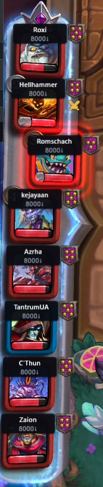

# HSBG Card Lookup — плагін для Hearthstone Deck Tracker

[English](README.md) | **Українська**

Ігровий оверлей для пошуку карт **Hearthstone Battlegrounds**. Натисніть гарячу клавішу — над грою
з'явиться панель пошуку; введіть запит, знайдіть карту (розумні фільтри за тіром, тайпом, ключовими
словами, статами), перегляньте арт, закрийте. Десктопний побратим [hsbg.cards](https://hsbg.cards).


- Швидкий структурований пошук + по формулюванням (`t3`, `5/5`, трайби, ключові слова, школи заклять)
- Повний арт карт, золоті версії, пов'язані карти (баді / токени / сили героя)
- **Витягуйте будь-яку карту** з оверлея як вільну плаваючу карту зі зміною розміру — зручно
  пояснювати карти глядачам на стрімі чи під час запису відео, або просто «припаркувати» кілька
  в кутку для довідки
- **Лайв-HUD трінкетів та аномалій** — ваші поточні менший/більший трінкети й аномалія лобі
  показуються прямо на екрані під час матчу, тож ні вам, ні глядачам не треба наводити курсор на
  кожен. Чудово для стрімів або соло-гри, і особливо для **глядачів із телефону**, які не можуть
  відкрити Twitch-розширення HDT, щоб побачити, яка аномалія активна чи які трінкети має стрімер
- Сповіщення про патч-ноути просто в застосунку
- Дані карт і арт самооновлюються з hsbg.cards; сам плагін оновлюється через GitHub Releases

Додано у v0.3:
- Відображення MMR та тіру опонентів прямо в лобі матчу
- Підтримка Dark Gifts у 3 режимах — показувати релевантних міньйонів після 6-го ходу ; показувати
  доступні dark gifts ; показувати і доступні dark gifts, і релевантних міньйонів з унікальними
  гіфтами, застосовними до них
- Збереження ваших бордів щораунду у файл .csv для подальшого аналізу даних
- Інші дрібні QoL-покращення

<p align="center">
  
  
  
  
  
  
  
  
  
  
</p>

> Лише Windows — це плагін до Hearthstone Deck Tracker. (Гравцям на Mac: тимчасово користуйтеся вебсайтом.)

## Встановлення

1. Завантажте найновіший zip зі сторінки [Releases](https://github.com/RTantrumR/HDT-Plugin-Cards/releases).
2. Розпакуйте його й двічі клікніть **`install.bat`** (закриє HDT, скопіює плагін куди треба) — або
   вручну перемістіть теку `HsbgCardLookup` до `%APPDATA%\HearthstoneDeckTracker\Plugins\`.
3. Запустіть HDT (увімкніть плагін у **Options → Plugins**, якщо буде запит).
4. Натисніть **F3**, щоб відкрити пошук.

Під час першого запуску плагін завантажує арт карт у фоні (~200 МБ, одноразово); далі він
відкривається миттєво й довантажує лише змінені карти.

### Керування

| Клавіша | Дія |
|---|---|
| `F3` | відкрити / закрити оверлей |
| ввід тексту | пошук (Tab перемикає розумний пошук, Esc закриває, Enter відкриває перший результат) |
| `F2`/`G` | показати золоту версію вибраного міньйона |
| `S` | повернути фокус у поле пошуку |
| клік по арту | відкрити цю карту на hsbg.cards |

Клавіші перепризначаються через кнопку **Settings** плагіна в HDT. У тому ж вікні вмикаються
**витягування карт** (з арту деталей та/або сітки результатів) і **HUD трінкетів / аномалій**
(опційно). Плаваючу карту рухайте перетягуванням за тіло, змінюйте розмір за верхній правий кут,
прибирайте кліком правою; HUD-карти запам'ятовують місце й розмір для кожного слота й показуються
лише коли активний Hearthstone або HDT.

## Вимоги

- Встановлений **Hearthstone Deck Tracker**.
- Hearthstone у режимі **Borderless / Windowed (Fullscreen)** (ексклюзивний повноекранний режим
  блокує будь-який оверлей — це й вимога самого HDT).
- .NET Framework 4.7.2 (вже встановлений, якщо працює HDT).

## Збірка з вихідного коду

**Інструментарій:** .NET Framework 4.7.2, WPF, C#. Збирати через **MSBuild із Visual Studio 2022** —
CLI `dotnet` не вміє запускати WPF-компілятор розмітки для net472. Проєкт навмисно класичного стилю
`.csproj` (SDK-стиль `<UseWPF>` — це функція .NET Core, ненадійна на net472).

Два набори файлів **не** комітяться й мають бути покладені в `libs\` один раз (вони сторонні / великі):

```powershell
# 1. Власні збірки HDT — на них посилаємось, не розповсюджуємо (Private=False).
$src = "$env:LOCALAPPDATA\HearthstoneDeckTracker\app-<найновіша версія>"
Copy-Item "$src\HearthstoneDeckTracker.exe" .\libs\
Copy-Item "$src\HearthDb.dll" .\libs\
Copy-Item "$src\Newtonsoft.Json.dll" .\libs\

# 2. Замикання декодера WebP (бандлиться з плагіном, Private=True).
#    Зберіть тимчасовий net472-проєкт із посиланням на SixLabors.ImageSharp 2.1.11 і скопіюйте його
#    вихідні DLL у libs\: SixLabors.ImageSharp.dll, System.Buffers.dll, System.Memory.dll,
#    System.Numerics.Vectors.dll, System.Runtime.CompilerServices.Unsafe.dll,
#    System.Text.Encoding.CodePages.dll
```

Вбудований знімок карт `HsbgCardLookup\data\cards.json` теж у gitignore — покладіть будь-який знімок
формату `{ patch, cardCount, cards: [...] }` (плагін усе одно оновлює його з API під час роботи).

```powershell
.\deploy.ps1                 # збірка Release + копія в теку Plugins HDT (автоперезапуск HDT)
.\package.ps1                 # збірка + dist\HsbgCardLookup-v<ver>.zip (версія читається з Plugin.cs; -Version перевизначає)
```

AnyCPU у x86-процесі HDT → попередження `MSB3270` про невідповідність архітектури очікуване й безпечне.

## Ліцензія

[Apache License 2.0](LICENSE). Сторонні компоненти — див. [NOTICE](NOTICE).

Функція MMR-міток опонентів на лідерборді натхненна плагіном
[HDT-BGMMRPlugin](https://github.com/Reign-in-blood/HDT-BGMMRPlugin) (MIT), далі змінена й
розширена додатковими можливостями та власним джерелом даних — деталі в NOTICE.

Hearthstone — торговельна марка Blizzard Entertainment, Inc. Це неофіційний фанатський проєкт, не
пов'язаний із Blizzard і не схвалений нею.
